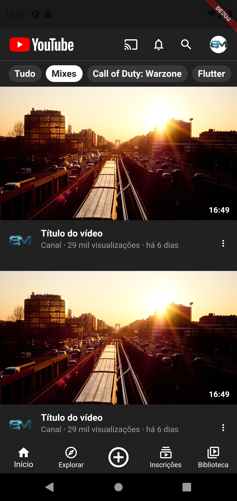

# Flutter - Youtube SpeedCoding

Este repositório visa reproduzir o layout da tela inicial do aplicativo Youtube como exercício de uso da ferramenta de deselvolvimento Flutter.

Tanto o repositório quanto o [vídeo](https://youtu.be/krC6WBrQWD0) não possuem qualquer tipo de patrocínio e o vídeo não é monetizado. Tudo foi feito puramente para fins educativos.

|  |  |
| ------------------------------------------ | -------------------------------------------- |
| Original                                   | Reprodução                                   |

## Executando a aplicação

Para executar este projeto, é necessário ter o ambiente de desenvolvimento configurado para uso do Flutter.

Basta clonar o projeto, acessar a raiz através de um terminal e executar os comandos:

```bash
flutter pub get
flutter run
```
